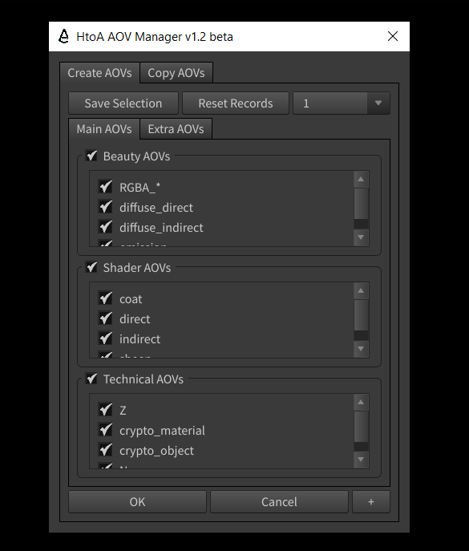

**HtoA AOV Manager**
---
Overview
---
*As of version 1.1 beta, this tool will create Arnold AOVs for the checked names and transfer them to the selected Arnold ROPs.*



---

**Main feature**:

Create checked list AOVs on the selected Arnold ROP.

---
**Usage**

1. Tick the AOVs from the tool and select the Arnold ROPs / Render Nodes in the Houdini Scene. Once press **OK** in tool to create AOVs on selected ROPs.
2. Can uncheck any AOV individually in the tool to ignore from creating and to ignore whole section like *Beauty AOVs/ Shader AOVs/ Tech AOVs* just uncheck main section.
3. If no Arnold ROP selected while executing then it will warn to select the Arnold ROP
4. If the AOV is already in the ROP then it will skip that AOV in that ROP.
5. If any blank or disabled AOV found then it will be removed.
6. In the top section UI there is option to save the selection of aovs for future use, which can go upto 5 times and one can reset the records as well.


---

**Changelog:** 

*version 1.1*

1. Right Mouse Click action on checked section will allow all aovs  go off on that section to select fewer item faster & Right Mouse Click + Control will check all aovs of checked section.

2. Save Selection , added input action to give name to selection set. 

3. Unchanged selection set will default the ticked options. 

4. Reset will properly revert all changes to default.
   
---
**Script Config in Houdini**

1. Copy the ***htoa_aov_manager*** folder in scripts folder of Houdini Documents.
i.e. *C:/Users/<username>/Documents/houdini{version}/scripts/python/*
2. To access this script through shelf use the following command.
  ```console
  import importlib
  from htoa_aov_manager import tool
  importlib.reload(tool)
  tool.main().
  ```
